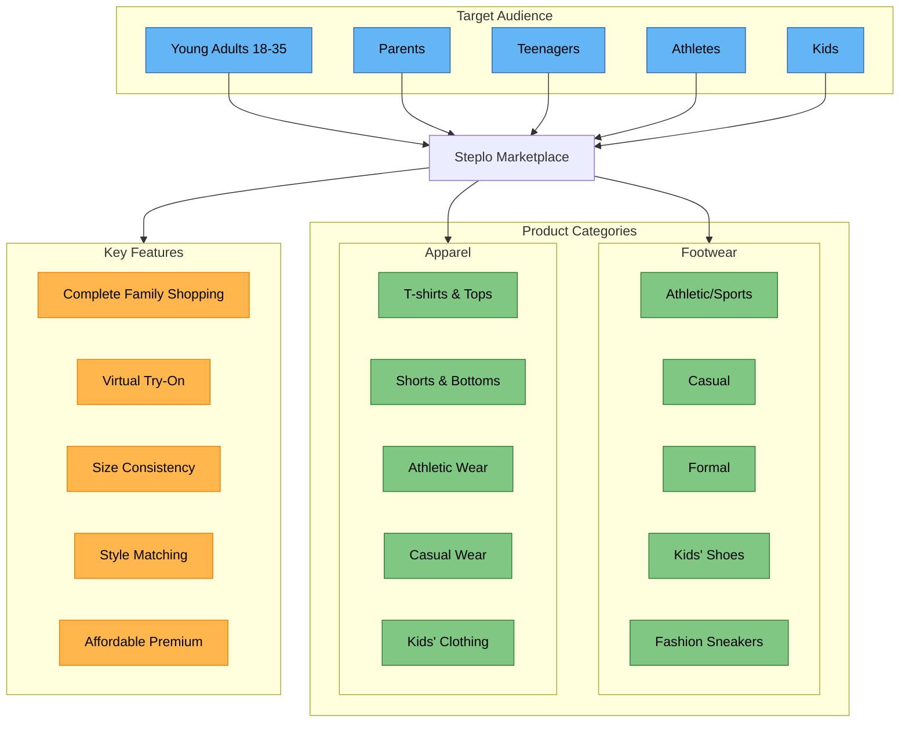
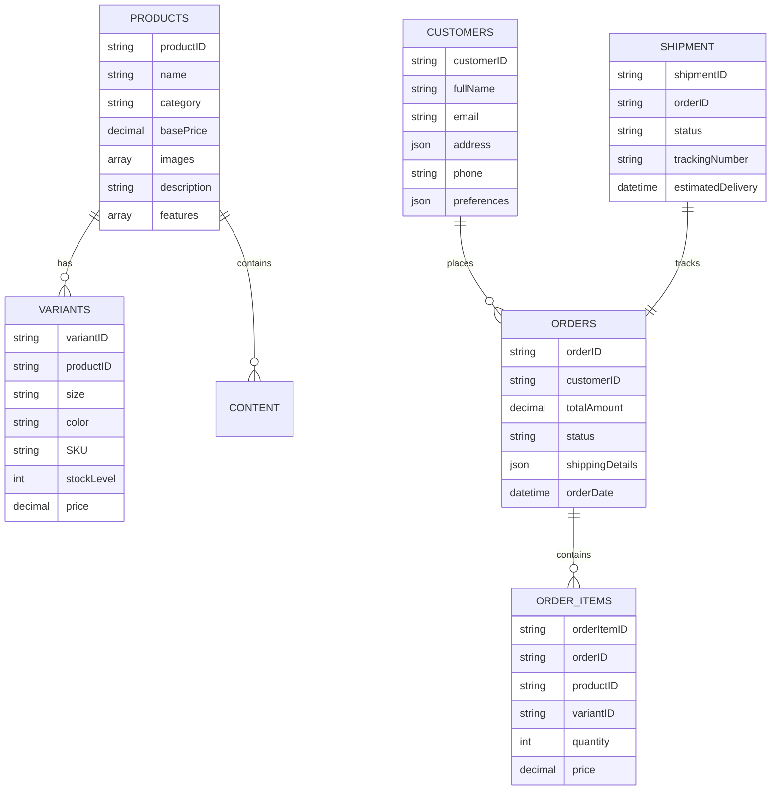
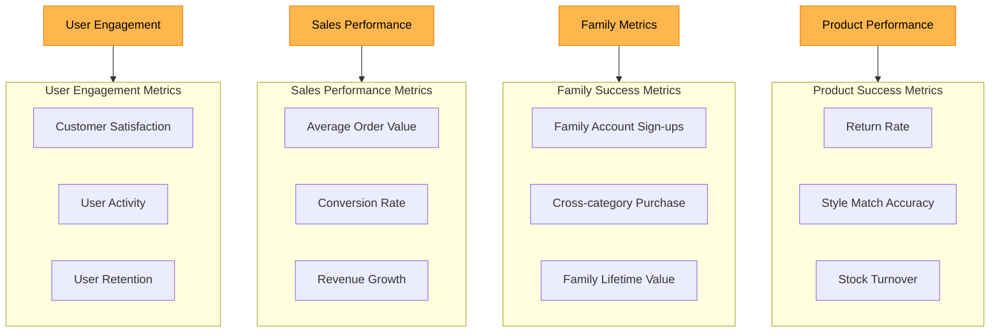

# Business Structure and Data Flow

## 1. Target Audience and Product Categories

## 2. Data Schema Relationships

## 3. Implementation Workflow

```mermaid
graph LR
    %% Define classes
    classDef phase1 fill:#64B5F6, stroke:#336699, color:black
    classDef phase2 fill:#81C784, stroke:#2E7D32, color:black

    %% Phase 1
    subgraph Phase1[Phase 1 - Core Features]
        AUTH[User Authentication]:::phase1
        CATALOG[Product Catalog]:::phase1
        CHECKOUT[Basic Checkout]:::phase1
        ORDERS[Order Management]:::phase1
    end

    %% Phase 2
    subgraph Phase2[Phase 2 - Enhanced Features]
        STYLE[Style Matching]:::phase2
        SIZE[Size Recommendations]:::phase2
        VIRTUAL[Virtual Fitting]:::phase2
        FAMILY[Family Account]:::phase2
    end

    %% Workflow
    AUTH --> CATALOG
    CATALOG --> CHECKOUT
    CHECKOUT --> ORDERS
    ORDERS --> STYLE
    STYLE --> SIZE
    SIZE --> VIRTUAL
    VIRTUAL --> FAMILY
```

## 4. Success Metrics Flow

---

_Created for NextJS Design JAM 2025_
