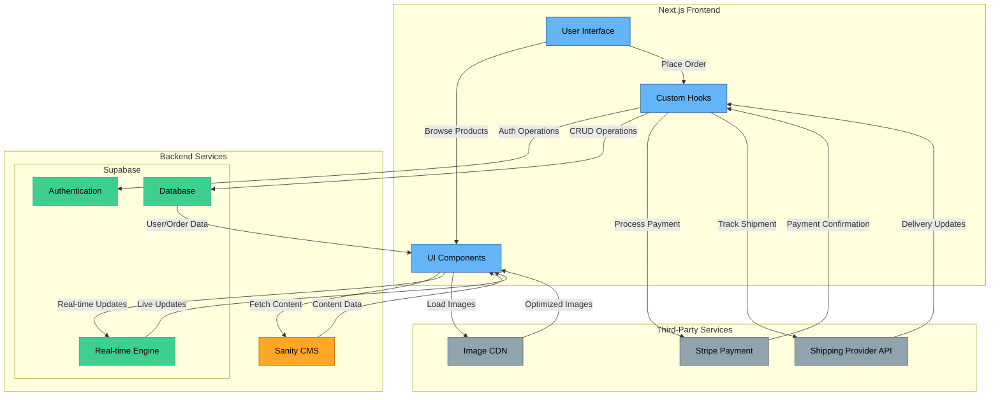
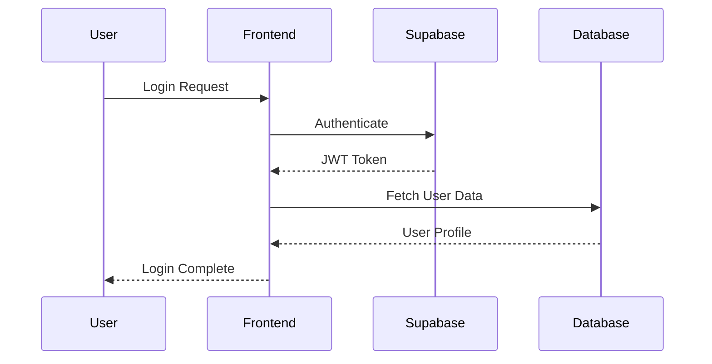
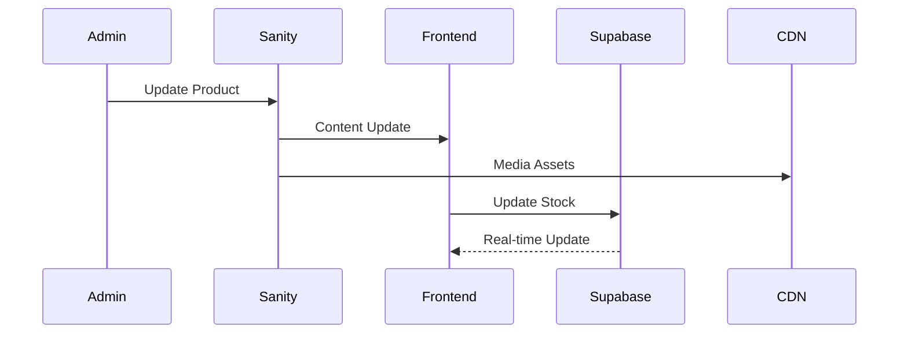
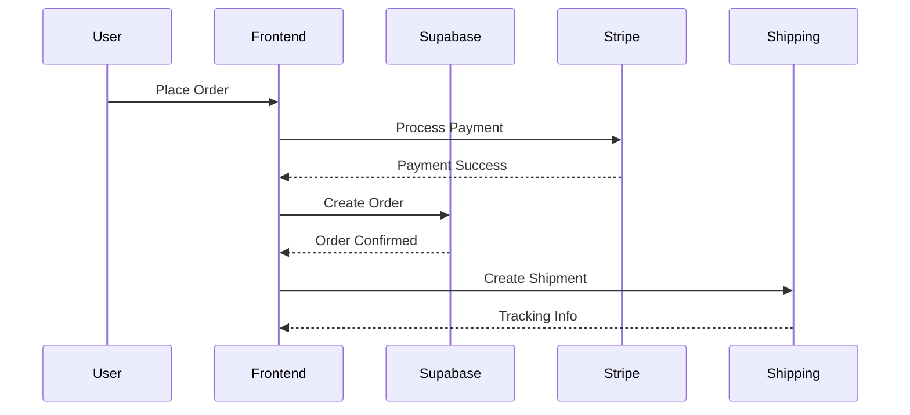

# System Architecture Design

## 1. High-Level Architecture

## 2. Component Architecture

### Frontend Layer (Next.js)

#### Core Components

- **Pages**: Server-side rendered routes
- **Components**: Reusable UI elements
- **Hooks**: Custom data fetching and state management
- **Utils**: Helper functions and utilities

#### State Management

- **React Context**: Application-wide state
- **React Query**: Server state management
- **Local Storage**: Client-side persistence
- **Supabase Realtime**: Live updates

### Backend Services

#### Sanity CMS

- **Content Studio**: Admin interface
- **GROQ API**: Content queries
- **Asset Pipeline**: Media management
- **Webhooks**: Content updates

#### Supabase

- **Authentication**

  - Social login providers
  - JWT management
  - Session handling
  - Role-based access

- **Database**

  - PostgreSQL database
  - Row Level Security
  - Real-time subscriptions
  - Automated backups

- **Real-time Engine**
  - Live data sync
  - Presence detection
  - Broadcast channels
  - Change notifications

### Third-Party Services

#### Payment Processing

- **Stripe**
  - Payment intents
  - Customer management
  - Subscription handling
  - Refund processing

#### Shipping Integration

- **Shipping Provider API**
  - Rate calculation
  - Label generation
  - Tracking updates
  - Delivery notifications

#### Media Delivery

- **CDN**
  - Image optimization
  - Global distribution
  - Cache management
  - Lazy loading

## 3. Data Flow Architecture

### Authentication Flow

### Product Management Flow

### Order Processing Flow

## 4. Security Architecture

### Authentication Security

- JWT-based authentication
- Role-based access control
- Session management
- 2FA support

### Data Security

- Row Level Security policies
- Data encryption
- API rate limiting
- CORS configuration

### Payment Security

- PCI compliance
- Secure payment processing
- Fraud prevention
- Transaction monitoring

## 5. Deployment Architecture

### Infrastructure

- **Frontend**: Vercel (Next.js)
- **Content**: Sanity Cloud
- **Database**: Supabase Cloud
- **Media**: CDN Provider

### Environments

- Development
- Staging
- Production
- QA/Testing

### Monitoring

- Performance metrics
- Error tracking
- Security alerts
- Business analytics

---

_Updated to include Supabase integration - NextJS Design JAM 2025_
