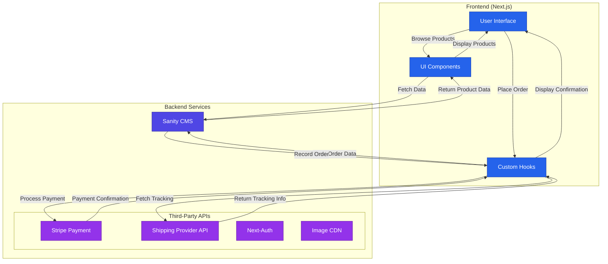

## **2. Design System Architecture**

### **High-Level System Architecture Diagram**


---

### **Explanation of the Architecture**
1. **Frontend (Next.js)**:
   - **User Interface (UI)**: The visual layer where users interact with the marketplace.
   - **UI Components**: Reusable components for product listings, cart, checkout, etc.
   - **Custom Hooks**: Handle API requests, state management, and data fetching.

2. **Backend Services**:
   - **Sanity CMS**: Manages product data, customer details, and order records.
   - **Third-Party APIs**:
     - **Stripe Payment**: Processes payments securely.
     - **Shipping Provider API**: Provides real-time shipment tracking.
     - **Next-Auth**: Handles user authentication.
     - **Image CDN**: Optimizes image delivery for faster loading.

---

### **Key Workflows**

1. **User Registration**:
   ```mermaid
   sequenceDiagram
       participant U as User
       participant F as Frontend
       participant A as API
       participant S as Sanity CMS
       participant Auth as Next-Auth

       U->>F: Visits registration page
       F->>A: Submit registration data
       A->>Auth: Validate credentials
       Auth-->>A: Return auth token
       A->>S: Store user profile
       S-->>A: Confirm storage
       A-->>F: Return success response
       F-->>U: Show confirmation
   ```

2. **Product Browsing**:
   ```mermaid
   sequenceDiagram
       participant U as User
       participant F as Frontend
       participant A as API
       participant S as Sanity CMS

       U->>F: Visits product listing page
       F->>A: Fetch product data
       A->>S: Query products
       S-->>A: Return product data
       A-->>F: Display products
       F-->>U: Show product listings
   ```

3. **Order Placement**:
   ```mermaid
   sequenceDiagram
       participant U as User
       participant F as Frontend
       participant A as API
       participant S as Sanity CMS
       participant STRIPE as Stripe
       participant SHIP as Shipping Provider

       U->>F: Adds items to cart
       F->>A: Send order details
       A->>S: Record order
       S-->>A: Confirm order
       A->>STRIPE: Process payment
       STRIPE-->>A: Payment confirmation
       A->>SHIP: Initiate shipment
       SHIP-->>A: Return tracking ID
       A-->>F: Display confirmation
       F-->>U: Show order summary
   ```

4. **Shipment Tracking**:
   ```mermaid
   sequenceDiagram
       participant U as User
       participant F as Frontend
       participant A as API
       participant SHIP as Shipping Provider

       U->>F: Visits order tracking page
       F->>A: Fetch tracking info
       A->>SHIP: Query shipment status
       SHIP-->>A: Return tracking details
       A-->>F: Display tracking info
       F-->>U: Show shipment status
   ```

---
