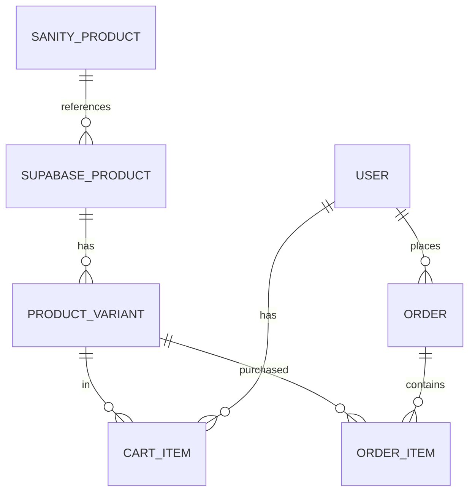

# Data Schema Design

## 1. Sanity CMS Schemas (Content Management)

### Product Content Schema

```typescript
export default {
  name: "product",
  title: "Product",
  type: "document",
  fields: [
    {
      name: "name",
      title: "Name",
      type: "string",
    },
    {
      name: "slug",
      title: "Slug",
      type: "slug",
      options: { source: "name" },
    },
    {
      name: "description",
      title: "Description",
      type: "array",
      of: [{ type: "block" }],
    },
    {
      name: "images",
      title: "Images",
      type: "array",
      of: [{ type: "image" }],
    },
    {
      name: "features",
      title: "Features",
      type: "array",
      of: [{ type: "string" }],
    },
    {
      name: "supabaseProductId",
      title: "Supabase Product ID",
      type: "string",
    },
  ],
};
```

### Marketing Content Schema

```typescript
export default {
  name: "marketing",
  title: "Marketing",
  type: "document",
  fields: [
    {
      name: "title",
      title: "Title",
      type: "string",
    },
    {
      name: "content",
      title: "Content",
      type: "array",
      of: [{ type: "block" }],
    },
    {
      name: "images",
      title: "Images",
      type: "array",
      of: [{ type: "image" }],
    },
    {
      name: "type",
      title: "Type",
      type: "string",
      options: {
        list: ["blog", "promotion", "guide"],
      },
    },
  ],
};
```

## 2. Supabase Schema (Operational Data)

### Products Table

```sql
-- Base product information
create table products (
  id uuid default uuid_generate_v4() primary key,
  sanity_id text references sanity.products,
  category_id uuid references categories(id),
  base_price decimal(10,2) not null,
  created_at timestamp with time zone default timezone('utc'::text, now()) not null
);

-- Enable Row Level Security
alter table products enable row level security;
```

### Product Variants Table

```sql
create table product_variants (
  id uuid default uuid_generate_v4() primary key,
  product_id uuid references products(id),
  size text not null,
  color text not null,
  sku text unique not null,
  price decimal(10,2) not null,
  stock_quantity integer not null,
  created_at timestamp with time zone default timezone('utc'::text, now()) not null
);

-- Enable RLS
alter table product_variants enable row level security;
```

### Users Table

```sql
create table user_profiles (
  id uuid references auth.users on delete cascade primary key,
  full_name text,
  shipping_address jsonb,
  phone text,
  preferences jsonb,
  created_at timestamp with time zone default timezone('utc'::text, now()) not null
);

-- Enable RLS
alter table user_profiles enable row level security;

-- User access policy
create policy "Users can view own profile"
  on user_profiles for select
  using (auth.uid() = id);
```

### Orders Table

```sql
create table orders (
  id uuid default uuid_generate_v4() primary key,
  user_id uuid references auth.users(id),
  status text not null,
  total_amount decimal(10,2) not null,
  shipping_address jsonb not null,
  payment_intent_id text,
  created_at timestamp with time zone default timezone('utc'::text, now()) not null
);

-- Enable RLS
alter table orders enable row level security;

-- Order access policy
create policy "Users can view own orders"
  on orders for select
  using (auth.uid() = user_id);
```

### Order Items Table

```sql
create table order_items (
  id uuid default uuid_generate_v4() primary key,
  order_id uuid references orders(id),
  variant_id uuid references product_variants(id),
  quantity integer not null,
  price_at_time decimal(10,2) not null,
  created_at timestamp with time zone default timezone('utc'::text, now()) not null
);

-- Enable RLS
alter table order_items enable row level security;

-- Order items access policy
create policy "Users can view own order items"
  on order_items for select
  using (
    auth.uid() in (
      select user_id from orders where id = order_items.order_id
    )
  );
```

### Cart Table

```sql
create table cart_items (
  id uuid default uuid_generate_v4() primary key,
  user_id uuid references auth.users(id),
  variant_id uuid references product_variants(id),
  quantity integer not null,
  created_at timestamp with time zone default timezone('utc'::text, now()) not null,
  unique(user_id, variant_id)
);

-- Enable RLS
alter table cart_items enable row level security;

-- Cart access policy
create policy "Users can manage own cart"
  on cart_items for all
  using (auth.uid() = user_id);
```

## 3. Data Relationships

### Content to Operational Data



## 4. Real-time Features

### Stock Updates

```typescript
// Subscribe to stock changes
const stockSubscription = supabase
  .from("product_variants")
  .on("UPDATE", (payload) => {
    // Handle stock update
  })
  .subscribe();
```

### Cart Synchronization

```typescript
// Subscribe to cart changes
const cartSubscription = supabase
  .from("cart_items")
  .on("*", (payload) => {
    // Handle cart update
  })
  .subscribe();
```

### Order Tracking

```typescript
// Subscribe to order status changes
const orderSubscription = supabase
  .from("orders")
  .on("UPDATE", (payload) => {
    // Handle order update
  })
  .subscribe();
```

## 5. Security Considerations

### Row Level Security

```sql
-- Example policies for each table
create policy "Public read access to products"
  on products for select
  using (true);

create policy "Users can only access their own data"
  on user_profiles for all
  using (auth.uid() = id);

create policy "Users can only access their own orders"
  on orders for all
  using (auth.uid() = user_id);
```

### Data Validation

```typescript
// Supabase type definitions
interface UserProfile {
  id: string;
  full_name: string;
  shipping_address: {
    street: string;
    city: string;
    postal_code: string;
    country: string;
  };
  phone: string;
  preferences: {
    size_preferences: string[];
    style_preferences: string[];
  };
}
```

## 6. Performance Optimizations

### Indexes

```sql
-- Create indexes for frequently accessed columns
create index idx_product_variants_product_id
  on product_variants(product_id);

create index idx_order_items_order_id
  on order_items(order_id);

create index idx_cart_items_user_id
  on cart_items(user_id);
```

### Caching Strategy

- Sanity content: CDN caching
- Supabase queries: Client-side caching
- Real-time updates: WebSocket subscriptions

---

_Updated to include Supabase integration - NextJS Design JAM 2025_
