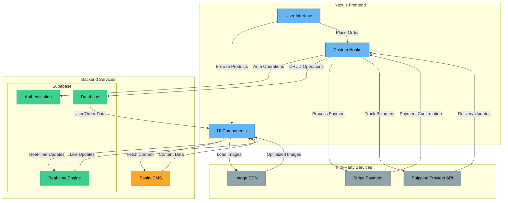
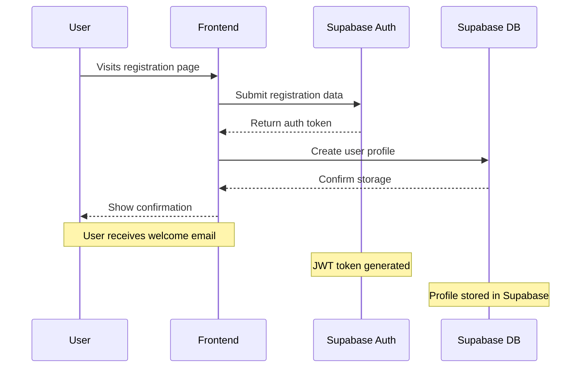
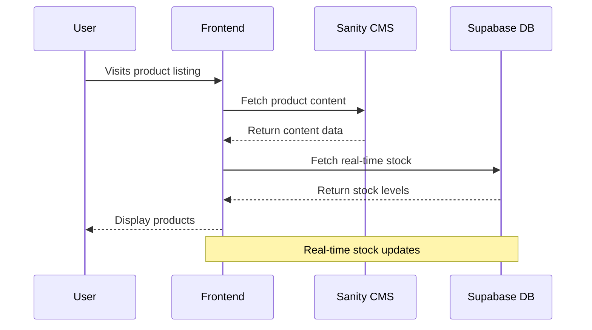
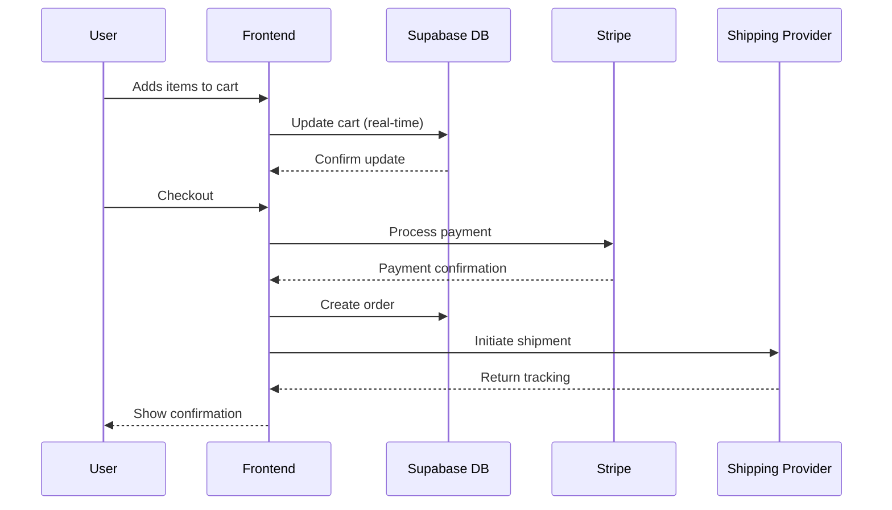

# **Marketplace Technical Foundation - Steplo**

---

## **1. System Architecture Overview**

### **System Architecture Diagram**



### **Component Roles**

- **Frontend (Next.js)**:
  - **User Interface (UI)**: The visual layer where users interact with the marketplace.
  - **UI Components**: Reusable components for product listings, cart, checkout, etc.
  - **Custom Hooks**: Handle API requests, state management, and data fetching.
- **Backend Services**:
  - **Sanity CMS**: Manages product data, customer details, and order records.
  - **Supabase**: Manages user authentication, real-time database, and order management.
  - **Third-Party APIs**:
    - **Stripe Payment**: Processes payments securely.
    - **Shipping Provider API**: Provides real-time shipment tracking.
    - **Image CDN**: Optimizes image delivery for faster loading.

---

## **2. Key Workflows**

### **User Registration & Authentication (Supabase)**



### **Product Browsing (Sanity + Supabase)**



### **Order Processing (Supabase + Stripe)**



---

## **3. API Implementation**

### **Authentication (Supabase)**

```typescript
// Initialize Supabase client
import { createClient } from "@supabase/supabase-js";

const supabase = createClient(
  process.env.NEXT_PUBLIC_SUPABASE_URL,
  process.env.NEXT_PUBLIC_SUPABASE_ANON_KEY
);

// Sign up
const signUp = async (email: string, password: string) => {
  const { user, error } = await supabase.auth.signUp({
    email,
    password,
  });
};

// Sign in
const signIn = async (email: string, password: string) => {
  const { user, error } = await supabase.auth.signIn({
    email,
    password,
  });
};
```

### **Product Management (Sanity + Supabase)**

```typescript
// Fetch product content from Sanity
const getProduct = async (slug: string) => {
  const product = await client.fetch(
    `
    *[_type == "product" && slug.current == $slug][0]{
      name,
      description,
      images,
      "variants": *[_type == "variant" && references(^._id)]
    }
  `,
    { slug }
  );
};

// Get real-time stock from Supabase
const getProductStock = async (productId: string) => {
  const { data, error } = await supabase
    .from("product_variants")
    .select("*")
    .eq("product_id", productId);
};

// Subscribe to stock updates
const subscribeToStock = (productId: string, callback: Function) => {
  const subscription = supabase
    .from(`product_variants:product_id=eq.${productId}`)
    .on("UPDATE", (payload) => {
      callback(payload.new);
    })
    .subscribe();
};
```

## **4. Security Implementation**

### **Row Level Security (Supabase)**

```sql
-- Enable RLS
ALTER TABLE cart_items ENABLE ROW LEVEL SECURITY;

-- Define policies
CREATE POLICY "Users can view own cart"
ON cart_items FOR SELECT
USING (auth.uid() = user_id);

CREATE POLICY "Users can update own cart"
ON cart_items FOR INSERT
WITH CHECK (auth.uid() = user_id);
```

## **5. Technical Roadmap**

### Phase 1: Core Infrastructure

- Set up Supabase project and authentication
- Configure Sanity CMS for content
- Implement basic product browsing
- Set up real-time cart management

### Phase 2: Enhanced Features

- Real-time inventory tracking
- Multi-device cart synchronization
- Order management system
- User profiles and preferences

### Phase 3: Advanced Features

- Analytics integration
- Performance optimization
- Advanced search capabilities
- Recommendation engine

## **6. Deployment Strategy**

### Infrastructure

- Next.js deployment on Vercel
- Sanity Cloud for content
- Supabase Cloud for operational data
- CDN for media delivery

### Monitoring

- Supabase Dashboard
- Sanity metrics
- Custom logging
- Error tracking

---

_Created for NextJS Design JAM 2025 Hackathon - Day 2_
