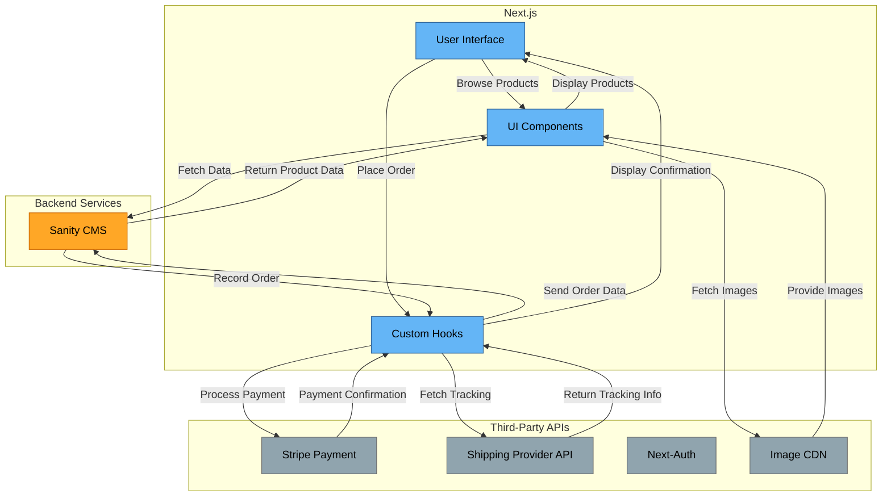
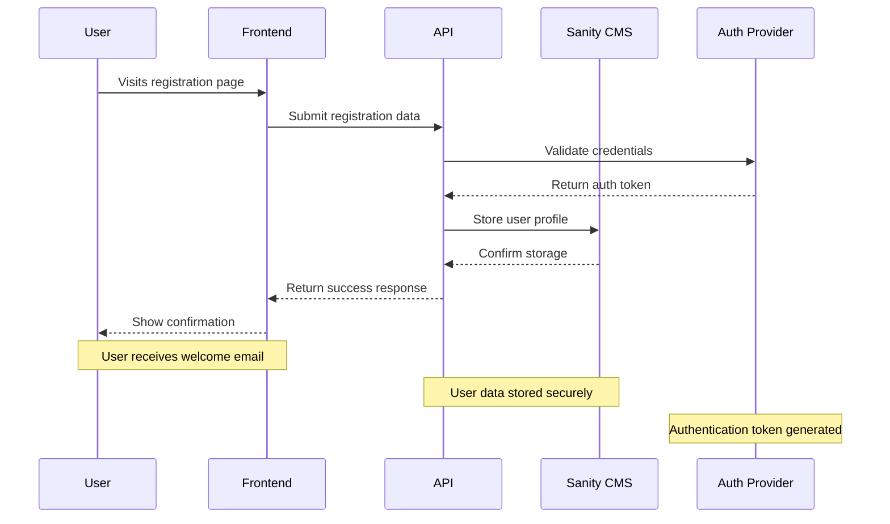
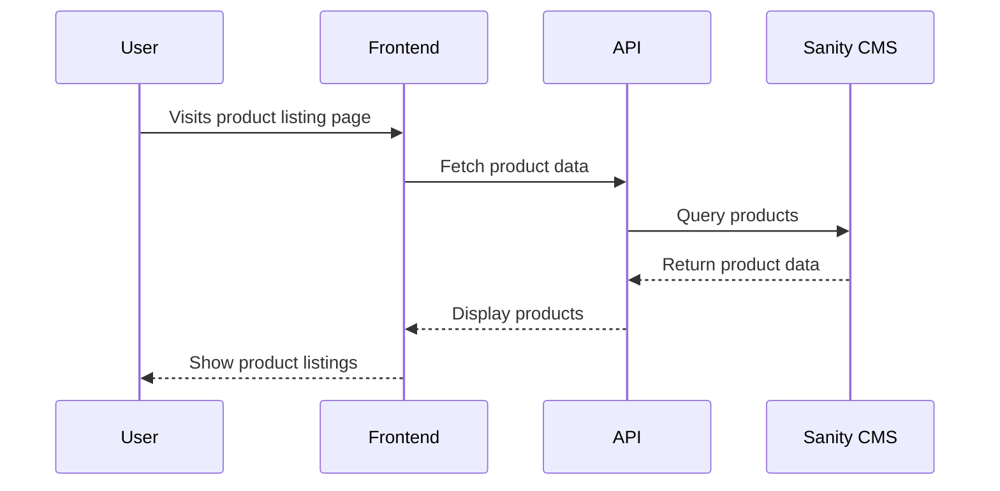
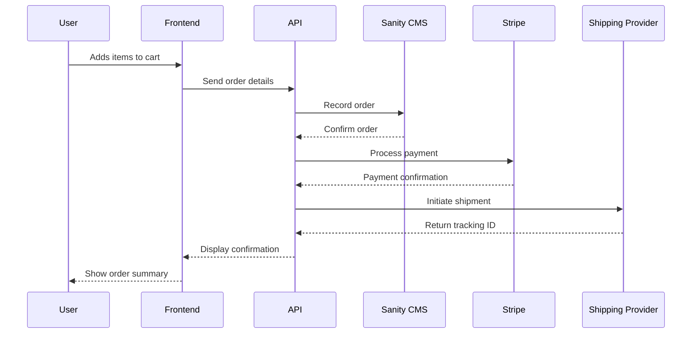
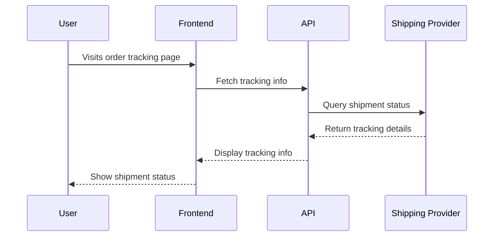

# **Marketplace Technical Foundation - Steplo**

---

## **1. System Architecture Overview**

### **System Architecture Diagram**


### **Component Roles**
- **Frontend (Next.js)**:
  - **User Interface (UI)**: The visual layer where users interact with the marketplace.
  - **UI Components**: Reusable components for product listings, cart, checkout, etc.
  - **Custom Hooks**: Handle API requests, state management, and data fetching.
- **Backend Services**:
  - **Sanity CMS**: Manages product data, customer details, and order records.
  - **Third-Party APIs**:
    - **Stripe Payment**: Processes payments securely.
    - **Shipping Provider API**: Provides real-time shipment tracking.
    - **Next-Auth**: Handles user authentication.
    - **Image CDN**: Optimizes image delivery for faster loading.

---

## **2. Key Workflows**

### **User Registration**


### **Product Browsing**


### **Order Placement**


### **Shipment Tracking**


---

## **3. Category-Specific Instructions**

### **General eCommerce**
- **Workflows**:
  - **Product Browsing**: Users can filter products by category, size, price range, and color.
  - **Cart Management**: Users can add/remove items, update quantities, and apply discounts.
  - **Order Placement**: Users can place orders, select shipping methods, and make payments.
- **Example Endpoint**:
  - **Endpoint**: `/api/products`
  - **Method**: `GET`
  - **Purpose**: Fetch all product details.
  - **Response Example**:
    ```json
    [
      {
        "id": "123",
        "name": "Premium Running Shoes",
        "price": 120,
        "stock": 50,
        "image": "https://cdn.example.com/shoes.jpg",
        "category": "Athletic",
        "sizes": ["7", "8", "9"],
        "colors": ["Black", "White"]
      }
    ]
    ```

---

## **4. API Endpoints**

### **API Specification**
| **Endpoint**         | **Method** | **Description**                          | **Response Example**                                                                 |
|-----------------------|------------|------------------------------------------|-------------------------------------------------------------------------------------|
| `/api/products`       | `GET`      | Fetch all products.                      | `[{ "id": "123", "name": "Running Shoes", "price": 120, "stock": 50, "image": "..." }]` |
| `/api/products/{id}`  | `GET`      | Fetch details of a specific product.     | `{ "id": "123", "name": "Running Shoes", "price": 120, "stock": 50, "image": "..." }`  |
| `/api/orders`         | `POST`     | Create a new order.                      | `{ "orderId": "ORD123", "status": "Success", "message": "Order created successfully." }` |
| `/api/shipment`       | `GET`      | Track order status.                      | `{ "shipmentId": "SHIP123", "status": "In Transit", "expectedDeliveryDate": "..." }`    |

---

## **5. Sanity Schema**

### **Product Schema**
```javascript
export default {
  name: 'product',
  title: 'Product',
  type: 'document',
  fields: [
    {
      name: 'name',
      title: 'Name',
      type: 'string',
    },
    {
      name: 'slug',
      title: 'Slug',
      type: 'slug',
      options: {
        source: 'name'
      }
    },
    {
      name: 'category',
      title: 'Category',
      type: 'reference',
      to: [{type: 'category'}]
    },
    {
      name: 'variants',
      title: 'Variants',
      type: 'array',
      of: [{
        type: 'object',
        fields: [
          {name: 'color', type: 'string'},
          {name: 'size', type: 'string'},
          {name: 'stock', type: 'number'},
          {name: 'images', type: 'array', of: [{type: 'image'}]}
        ]
      }]
    },
    {
      name: 'price',
      title: 'Price',
      type: 'number'
    },
    {
      name: 'description',
      title: 'Description',
      type: 'text'
    }
  ]
}
```

---

### **Order Schema**
```javascript
export default {
  name: 'order',
  title: 'Order',
  type: 'document',
  fields: [
    {
      name: 'orderId',
      title: 'Order ID',
      type: 'string',
    },
    {
      name: 'customer',
      title: 'Customer',
      type: 'reference',
      to: [{type: 'customer'}]
    },
    {
      name: 'products',
      title: 'Products',
      type: 'array',
      of: [
        {
          type: 'object',
          fields: [
            {name: 'product', type: 'reference', to: [{type: 'product'}]},
            {name: 'quantity', type: 'number'},
            {name: 'price', type: 'number'},
            {name: 'size', type: 'string'},
            {name: 'color', type: 'string'}
          ]
        }
      ]
    },
    {
      name: 'totalAmount',
      title: 'Total Amount',
      type: 'number'
    },
    {
      name: 'paymentStatus',
      title: 'Payment Status',
      type: 'string',
      options: {
        list: ['Pending', 'Paid', 'Failed']
      }
    },
    {
      name: 'shippingAddress',
      title: 'Shipping Address',
      type: 'text'
    },
    {
      name: 'shippingMethod',
      title: 'Shipping Method',
      type: 'string',
      options: {
        list: ['Standard', 'Express']
      }
    },
    {
      name: 'orderDate',
      title: 'Order Date',
      type: 'datetime'
    },
    {
      name: 'deliveryETA',
      title: 'Delivery ETA',
      type: 'datetime'
    }
  ]
}
```

---

### **Customer Schema**
```javascript
export default {
  name: 'customer',
  title: 'Customer',
  type: 'document',
  fields: [
    {
      name: 'customerId',
      title: 'Customer ID',
      type: 'string',
    },
    {
      name: 'name',
      title: 'Full Name',
      type: 'string',
    },
    {
      name: 'email',
      title: 'Email',
      type: 'string',
    },
    {
      name: 'phone',
      title: 'Phone',
      type: 'string',
    },
    {
      name: 'address',
      title: 'Address',
      type: 'text',
    },
    {
      name: 'sizePreferences',
      title: 'Size Preferences',
      type: 'array',
      of: [{type: 'string'}]
    },
    {
      name: 'stylePreferences',
      title: 'Style Preferences',
      type: 'array',
      of: [{type: 'string'}]
    },
    {
      name: 'orderHistory',
      title: 'Order History',
      type: 'array',
      of: [{type: 'reference', to: [{type: 'order'}]}]
    }
  ]
}
```

---

### **Category Schema**
```javascript
export default {
  name: 'category',
  title: 'Category',
  type: 'document',
  fields: [
    {
      name: 'name',
      title: 'Name',
      type: 'string',
    },
    {
      name: 'slug',
      title: 'Slug',
      type: 'slug',
      options: {
        source: 'name'
      }
    },
    {
      name: 'description',
      title: 'Description',
      type: 'text'
    }
  ]
}
```

---

### **Inventory Schema**
```javascript
export default {
  name: 'inventory',
  title: 'Inventory',
  type: 'document',
  fields: [
    {
      name: 'product',
      title: 'Product',
      type: 'reference',
      to: [{type: 'product'}]
    },
    {
      name: 'sizeDistribution',
      title: 'Size Distribution',
      type: 'array',
      of: [
        {
          type: 'object',
          fields: [
            {name: 'size', type: 'string'},
            {name: 'stock', type: 'number'}
          ]
        }
      ]
    },
    {
      name: 'colorVariants',
      title: 'Color Variants',
      type: 'array',
      of: [{type: 'string'}]
    },
    {
      name: 'location',
      title: 'Location',
      type: 'string'
    },
    {
      name: 'reorderLevel',
      title: 'Reorder Level',
      type: 'number'
    },
    {
      name: 'lastRestockDate',
      title: 'Last Restock Date',
      type: 'datetime'
    }
  ]
}
```

---

### **Shipment Schema**
```javascript
export default {
  name: 'shipment',
  title: 'Shipment',
  type: 'document',
  fields: [
    {
      name: 'shipmentId',
      title: 'Shipment ID',
      type: 'string',
    },
    {
      name: 'order',
      title: 'Order',
      type: 'reference',
      to: [{type: 'order'}]
    },
    {
      name: 'deliveryZone',
      title: 'Delivery Zone',
      type: 'string',
    },
    {
      name: 'status',
      title: 'Status',
      type: 'string',
      options: {
        list: ['Pending', 'Shipped', 'In Transit', 'Delivered']
      }
    },
    {
      name: 'deliverySLA',
      title: 'Delivery SLA',
      type: 'string',
    }
  ]
}
```

---

## 6. Technical Roadmap

### Phase 1: Core Features
- **Frontend**:
  - Implement essential pages: Home, Product Listing, Product Details, Cart, Checkout.
  - Add responsive design for mobile and desktop.
- **Backend**:
  - Set up Sanity CMS for product and order management.
  - Integrate Stripe for payment processing.
- **APIs**:
  - Implement `/api/products` and `/api/orders` endpoints.

### Phase 2: Enhanced Features
- **Frontend**:
  - Add advanced features: size selection, color variants, related products.
  - Implement user dashboard for order tracking.
- **Backend**:
  - Add inventory management and low stock alerts.
  - Integrate shipment tracking API.
- **APIs**:
  - Implement `/api/shipment` and `/api/users` endpoints.

### Phase 3: Optimization and Launch
- **Performance**:
  - Optimize images and enable caching.
  - Use Next.js’s built-in optimizations.
- **SEO**:
  - Add meta tags and structured data.
- **Testing**:
  - Test for usability, performance, and security.
- **Launch**:
  - Deploy on Vercel and monitor performance.
