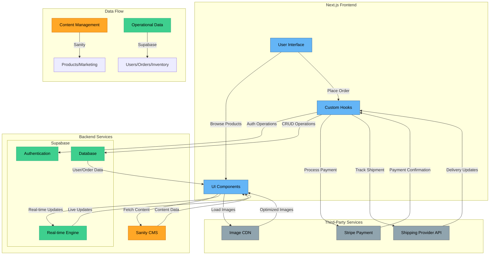

# Updated System Architecture with Supabase Integration



## Key Components

### Frontend (Next.js)

- **User Interface**: React components and pages
- **UI Components**: Reusable components for product display, cart, etc.
- **Custom Hooks**: Data fetching and state management

### Sanity CMS

- Product content and descriptions
- Marketing materials
- Media assets
- SEO content

### Supabase

- **Authentication**: User management and sessions
- **Database**: Orders, inventory, and user data
- **Real-time Engine**: Live updates and notifications

### Third-Party Services

- **Stripe**: Payment processing
- **Shipping API**: Order tracking
- **CDN**: Image optimization and delivery

## Data Flow

1. **Content Flow**

   - Sanity → Product information
   - Supabase → Operational data
   - CDN → Media delivery

2. **User Flow**

   - Authentication via Supabase
   - Real-time cart updates
   - Order processing and tracking

3. **Order Flow**
   - Cart management in Supabase
   - Payment processing via Stripe
   - Order tracking via Shipping API

```

```
